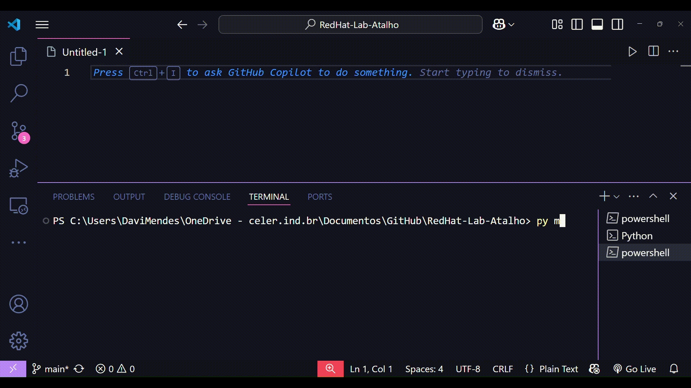

# 🚀 RedHat Lab Executor

Automatize a digitação dos comandos nos laboratórios da Red Hat com estilo, praticidade e zero sofrimento mental.  
Este script foi criado para **universitários que não aguentam mais digitar `ssh student@servera` pela milésima vez**. 🙃

---

## ✨ O que é isso?

Um script Python que simula seu teclado e **digita automaticamente os comandos do laboratório** por você.  
Funciona em terminais via navegador, como as VMs utilizadas nos labs da **Red Hat Academy**, **Cisco Netacad**, etc.

> Ele usa a biblioteca `pyautogui` para simular as teclas. Você só precisa preparar o terreno, clicar no terminal e deixar o script fazer o resto. 😉

---

## 📁 Estrutura do Projeto

```
RedHat-Lab-Atalho/
├── comandos.txt       # Lista dos comandos a serem executados
└── executor.py        # Script Python que envia os comandos simulando teclado
```

---

## 🛠️ Como usar

### 1. ✅ Instale as dependências
```bash
pip install pyautogui
```

### 2. ✍️ Edite o `comandos.txt`

Antes de iniciar **qualquer laboratório**, **copie e cole os comandos EXATOS** (e na ordem correta!) que você terá que digitar durante o lab.

Exemplo:
```
⚠️ **Sujestão de uso, não inicie o lab com os script, o lab as vezes demora para iniciar, coso demore mais que 5 segundos da ruim**

lab start users-user
ssh student@servera
sudo -i
student
```


> ⚠️ **A ordem importa!** Se os comandos estiverem fora de sequência, o lab pode não funcionar corretamente. Você foi avisado. 😅

---

### 3. 🖥️ Habilite o Host Paste

No terminal web da Red Hat Academy, **clique no botão "Host Paste"** no canto superior direito da janela.  
Isso é essencial para que o terminal aceite as entradas do teclado simulado!

---

### 4. ▶️ Execute o script

No terminal local (VS Code, PowerShell, cmd, etc), digite:

```bash
python executor.py
```

Ele vai mostrar algo assim:

```
==================================================
 Red Hat Lab Executor - Automático com Delay 
==================================================
Você tem 5 segundos para clicar no terminal web ou bloco de notas...
```

---

### 5. 🖱️ Clique no terminal web!

Enquanto o script faz a contagem regressiva (5 segundos), **clique dentro do terminal do navegador** onde você executa os comandos do laboratório.

> Após isso, o script vai digitar automaticamente cada comando com uma pausa de 3 segundos entre eles.

---

### 📽️ Demonstração



---

## 📌 Dicas úteis

- Quer testar antes de usar no lab?  
  Use um site tipo [editpad.org](https://editpad.org) pra simular um terminal.

- O tempo entre os comandos é de **3 segundos**, mas pode ser ajustado no `executor.py`:
  ```python
  time.sleep(3)
  ```

- Se quiser modo manual (pressionar Enter pra avançar comando a comando), peça que o Gepeto ative isso. 🤖

---

## 🧠 Por que isso existe?

Porque digitar os mesmos comandos 30 vezes por semana é um teste de paciência.  
Feito por e para universitários que só querem **sobreviver aos labs** com o mínimo de sofrimento. 🧃

---

## 👾 Requisitos

- Python 3.8+
- `pyautogui`
- Um pouco de juízo (ou pelo menos copiar os comandos direito 😅)

---

## 🤖 Interpretação apra IA

#Use esa mensagem para que a IA interprete o conteudo do laboratorio e gere os comandos

```bash
1. Toda linha que começa com `$ comando...` ou `# comando...` deve ir direto como linha no txt.
2. Quando for abrir o `vim`, inserir as seguintes tags:
   - `vim /caminho/script`
   - `[i]` (antes do conteúdo do script)
   - Código do script (linha a linha)
   - `[esc]`
   - `:wq`
3. Qualquer instrução que diga "execute em segundo plano" deve adicionar `&` ao final.
4. Quando houver menções a:
   - "Aguarde", "observe", "confirme" → adicionar `[sleep-2]`, `[sleep-5]`, ou `[sleep-10]` conforme o tempo
   - "Saia do top" → `[ctrl+c]`
   - "Pressione tecla..." → usar tags `[m]`, `[t]`, `[shift+p]`, `[shift+w]`, etc.
   - "Salve e saia do vim" → `:wq`
5. Ao encontrar `Password:`, incluir a senha diretamente (ex: `redhat`) na próxima linha.
6. Para comandos finais como avaliação ou finalização → adicionar no fim:
   - `lab grade <lab-name>`
   - `lab finish <lab-name>`
```


---

## 🙋‍♂️ Feito com raiva de digitar por:  
**Davi Mendes**  
💻 Engenharia de Software - PUC Minas
